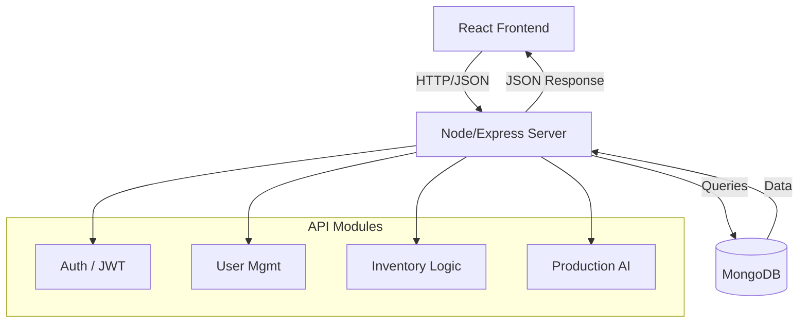

# Backend Architecture Design

## 1. Technology Stack (MERN)
We will use the **MERN** stack, which pairs perfectly with your React frontend.

*   **Runtime**: **Node.js** (Fast, scalable, JavaScript everywhere)
*   **Framework**: **Express.js** (Standard web server framework)
*   **Database**: **MongoDB** (NoSQL, flexible schemas for Inventory/Products)
*   **ODM**: **Mongoose** (Data validation and schema modeling)
*   **Auth**: **JWT** (Stateless authentication)

## 2. Database Schema Design
Here is how the data will be structured in MongoDB:

### Users Collection (`users`)
| Field | Type | Description |
| :--- | :--- | :--- |
| `name` | String | Full Name |
| `email` | String | Unique Login Email |
| `password` | String | Hashed Password (Bcrypt) |
| `role` | Enum | `Super Admin`, `Admin`, `User` |

### Products/Models Collection (`models`)
| Field | Type | Description |
| :--- | :--- | :--- |
| `name` | String | Model Name (e.g., "Air Filter X") |
| `sku` | String | Unique Stock Keeping Unit |
| `specs` | Object | Dimensions, Weight, Series |
| `image` | String | URL to stored image |

### Inventory Collection (`inventory`)
| Field | Type | Description |
| :--- | :--- | :--- |
| `item` | Ref | Link to `models` |
| `quantity` | Number | Current stock level |
| `location` | String | Warehouse Bin/Section |
| `minLevel` | Number | Reorder point alert |

### Transactions/Movements (`transactions`)
| Field | Type | Description |
| :--- | :--- | :--- |
| `type` | Enum | `RECEIPT` (In) or `DISPATCH` (Out) |
| `items` | Array | List of `{ itemId, qty }` |
| `date` | Date | Timestamp |
| `vendor` | Ref | Link to Vendor (if Receipt) |

## 3. API Architecture

## 4. Key Workflows

### Authentication
1.  Frontend sends `email/password`.
2.  Backend verifies hash -> sends `token`.
3.  Frontend stores `token` -> sends in Header `Authorization: Bearer ...`.

### Inventory Update
1.  **Receive**: User submits `MaterialsReceive` form.
2.  Backend creates `Transaction` record (Receipt).
3.  Backend increments `Inventory` quantity for those items.

### Production Logic
1.  **Dispatch**: User submits `MaterialDispatch`.
2.  Backend checks if `Stock >= Request`.
3.  If yes, deduct Stock, create `Transaction` (Dispatch).
4.  If not, return Error "Insufficient Stock".
