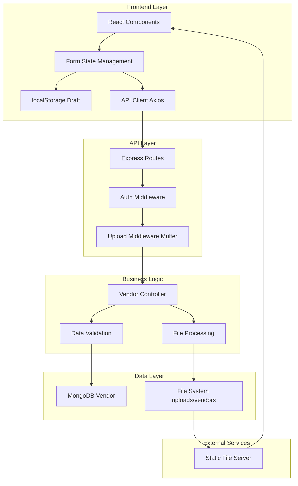
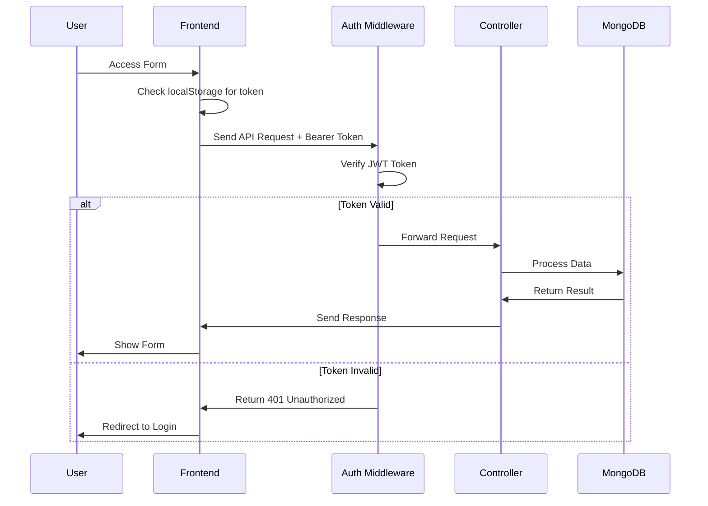
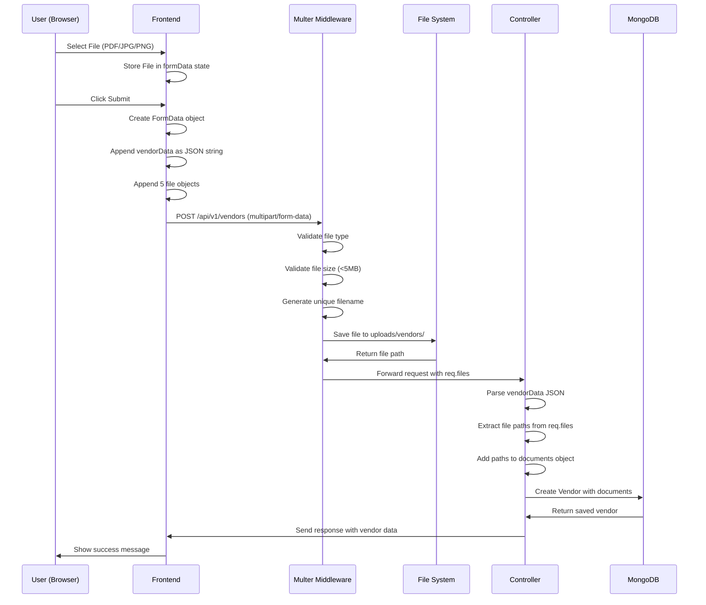
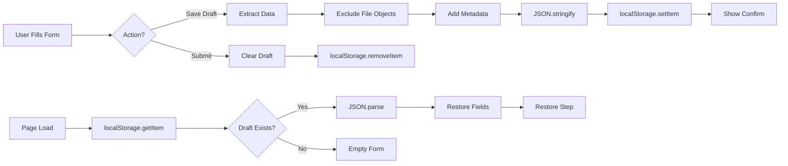

# Vendor Onboarding System - Logic & Architecture

## 🏗️ System Architecture Overview

This document details the technical architecture, logic flows, and design decisions for the vendor onboarding system.

---

## 📐 Architecture Diagram



---

## 🧩 Component Architecture

### Frontend Components

#### 1. VendorOnboarding.jsx (Single-Page)
```
VendorOnboarding
├── State Management
│   ├── formData (useState)
│   ├── loading (useState)
│   └── Draft Effect (useEffect)
│
├── Event Handlers
│   ├── update()
│   ├── handleCheckboxArray()
│   ├── handleFileChange()
│   ├── saveDraft()
│   └── handleSubmit()
│
├── UI Components
│   ├── Header
│   ├── Form Sections (22)
│   │   ├── Section 1-5
│   │   ├── Section 6-10
│   │   ├── Section 11-15
│   │   ├── Section 16-20
│   │   └── Section 21-22
│   └── Footer Buttons
│
└── Reusable Components
    ├── Section
    ├── Grid
    ├── Input
    ├── Select
    ├── CheckboxItem
    └── FileUploadBox
```

#### 2. VendorOnboardingReplica.jsx (Multi-Step)
```
VendorOnboardingReplica
├── State Management
│   ├── formData (useState)
│   ├── currentStep (useState)
│   ├── loading (useState)
│   └── Draft Effect (useEffect)
│
├── Navigation
│   ├── Stepper UI
│   ├── handleNext()
│   ├── handlePrev()
│   └── Step Progress Indicator
│
├── Event Handlers
│   ├── update()
│   ├── handleCheckboxArray()
│   ├── handleFileChange()
│   ├── saveDraft()
│   └── handleSubmit()
│
└── Step Components
    ├── Step 1: Supplier & Address
    ├── Step 2: Payment & Contact
    ├── Step 3: Bank & Status
    ├── Step 4: Products & Docs
    └── Step 5: Compliance & Final
```

---

## 🔐 Authentication Flow



**Implementation**:
```javascript
// backend/middleware/auth.js (existing)
const protect = async (req, res, next) => {
    let token;
    
    if (req.headers.authorization?.startsWith('Bearer')) {
        token = req.headers.authorization.split(' ')[1];
    }
    
    if (!token) {
        return res.status(401).json({ message: 'Not authorized' });
    }
    
    try {
        const decoded = jwt.verify(token, process.env.JWT_SECRET);
        req.user = await User.findById(decoded.id);
        next();
    } catch (error) {
        return res.status(401).json({ message: 'Token failed' });
    }
};
```

---

## 📤 File Upload Logic

### Upload Flow Diagram



### Multer Configuration Logic

```javascript
// backend/middleware/upload.js
const storage = multer.diskStorage({
    destination: (req, file, cb) => {
        // Upload directory
        cb(null, 'uploads/vendors/');
    },
    filename: (req, file, cb) => {
        // Parse vendor name from request
        let sanitizedName = 'vendor';
        try {
            const data = JSON.parse(req.body.vendorData);
            sanitizedName = data.name
                .replace(/[^a-z0-9]/gi, '_')
                .toLowerCase();
        } catch (e) {
            console.log('Using default filename');
        }
        
        // Generate unique filename
        const uniqueSuffix = Date.now() + '-' + Math.round(Math.random() * 1E9);
        const ext = path.extname(file.originalname);
        
        cb(null, `${sanitizedName}_${file.fieldname}_${uniqueSuffix}${ext}`);
    }
});

const fileFilter = (req, file, cb) => {
    // Allowed MIME types
    const allowedTypes = /pdf|jpeg|jpg|png/;
    
    // Check extension
    const extname = allowedTypes.test(
        path.extname(file.originalname).toLowerCase()
    );
    
    // Check MIME type
    const mimetype = allowedTypes.test(file.mimetype);
    
    if (extname && mimetype) {
        cb(null, true);  // Accept file
    } else {
        cb(new Error('Only PDF, JPG, JPEG, and PNG files allowed!'));
    }
};

const upload = multer({
    storage: storage,
    fileFilter: fileFilter,
    limits: {
        fileSize: 5 * 1024 * 1024  // 5MB
    }
});

// Export for 5 file fields
module.exports = upload.fields([
    { name: 'cancelledCheque', maxCount: 1 },
    { name: 'panDocument', maxCount: 1 },
    { name: 'gstDocument', maxCount: 1 },
    { name: 'tanDocument', maxCount: 1 },
    { name: 'signatureDocument', maxCount: 1 }
]);
```

**File Naming Convention**:
```
Pattern: {supplierName}_{fieldname}_{timestamp}-{random}.{ext}

Examples:
- abc_electronics_ltd_cancelledCheque_1703515200000-123456789.pdf
- test_company_panDocument_1703515201000-987654321.jpg
- supplier_name_gstDocument_1703515202000-456789123.png
```

---

## 💾 Draft Saving Logic

### localStorage Strategy



### Implementation Details

#### Save Draft Logic
```javascript
const saveDraft = () => {
    try {
        // 1. Destructure to exclude file objects
        const { 
            cancelledCheque, 
            panDocument, 
            gstDocument, 
            tanDocument, 
            signatureDocument,
            ...textData 
        } = formData;
        
        // 2. Create draft object
        const draftObj = {
            ...textData,
            currentStep,  // Multi-step only
            savedAt: new Date().toISOString()
        };
        
        // 3. Convert to JSON string
        const jsonString = JSON.stringify(draftObj);
        
        // 4. Save to localStorage
        localStorage.setItem('vendorDraft', jsonString);
        
        // 5. User feedback
        alert('✅ Draft saved successfully!');
        
        console.log(`Draft saved: ${Object.keys(textData).length} fields`);
    } catch (error) {
        console.error('Draft save failed:', error);
        alert('❌ Failed to save draft');
    }
};
```

#### Load Draft Logic
```javascript
useEffect(() => {
    const loadDraft = () => {
        try {
            // 1. Get from localStorage
            const draftString = localStorage.getItem('vendorDraft');
            
            if (!draftString) {
                console.log('No draft found');
                return;
            }
            
            // 2. Parse JSON
            const parsed = JSON.parse(draftString);
            
            // 3. Extract metadata
            const { savedAt, currentStep, ...draftData } = parsed;
            
            // 4. Restore to state (merge with defaults)
            setFormData(prev => ({ ...prev, ...draftData }));
            
            // 5. Restore step (multi-step only)
            if (currentStep) {
                setCurrentStep(currentStep);
            }
            
            // 6. Log for debugging
            const savedDate = new Date(savedAt).toLocaleString();
            console.log(`Draft loaded from ${savedDate}`);
            console.log(`Restored ${Object.keys(draftData).length} fields`);
            
        } catch (error) {
            console.error('Draft load failed:', error);
            // Corrupted draft - clear it
            localStorage.removeItem('vendorDraft');
        }
    };
    
    loadDraft();
}, []);  // Empty deps = run once on mount
```

### Why File Objects Can't Be Saved

**Problem**:
```javascript
// This FAILS
const fileObj = document.getElementById('fileInput').files[0];
localStorage.setItem('file', JSON.stringify(fileObj));
// Error: Converting circular structure to JSON
```

**Reason**:
1. File objects contain native browser methods
2. These methods have circular references
3. JSON.stringify() can't handle circular refs
4. localStorage only stores strings

**Solution**:
```javascript
// Don't save File objects
const { cancelledCheque, panDocument, ...textData } = formData;

// Only save serializable text data
localStorage.setItem('draft', JSON.stringify(textData));
```

**User Impact**:
- ✅ Text fields restored perfectly
- ✅ Radio/checkbox selections restored
- ❌ File uploads NOT restored
- 👉 User must re-select files after reload

---

## 🗄️ Database Schema Logic

### Vendor Model Design

```javascript
// backend/models/Vendor.js
const VendorSchema = new mongoose.Schema({
    // Auto-generated fields
    vendorId: {
        type: String,
        unique: true
        // Generated via pre-save hook: V-XXXX
    },
    createdAt: {
        type: Date,
        default: Date.now
    },
    
    // Required core fields
    name: {
        type: String,
        required: [true, 'Vendor name required']
    },
    email: {
        type: String,
        required: [true, 'Email required'],
        unique: true
    },
    contact: {
        type: String,
        required: [true, 'Contact person required']
    },
    phone: {
        type: String,
        required: [true, 'Phone required']
    },
    
    // Optional core fields
    type: String,
    city: String,
    status: {
        type: String,
        enum: ['Active', 'Pending', 'Blocked'],
        default: 'Pending'
    },
    
    // Nested objects
    address: {
        street: String,
        state: String,
        zip: String,
        country: { type: String, default: 'India' }
    },
    
    bank: {
        name: String,
        account: String,
        ifsc: String
    },
    
    tax: {
        pan: String,
        gst: String,
        tan: String,
        gstVendorClass: {
            type: String,
            enum: ['Registered', 'Not Registered', 'Composition', 'Govt Org']
        }
    },
    
    gstContact: {
        phone: String,
        email: String
    },
    
    staff: {
        sales: Number,
        service: Number,
        others: Number,
        total: Number
    },
    
    // Arrays
    vendorStatus: [{
        type: String,
        enum: ['Proprietor', 'Ltd', 'Co', 'Partnership']
    }],
    
    materialSupplyMode: [{
        type: String,
        enum: ['By Road', 'Courier', 'Other']
    }],
    
    // Document paths (CRITICAL)
    documents: {
        cancelledCheque: String,
        panDocument: String,
        gstDocument: String,
        tanDocument: String,
        signatureDocument: String
    },
    
    // Extended fields
    companyPrefix: {
        type: String,
        enum: ['Company', 'Mr', 'Ms'],
        default: 'Company'
    },
    currency: {
        type: String,
        enum: ['INR', 'USD', 'EURO'],
        default: 'INR'
    },
    industrialStatus: {
        type: String,
        enum: ['Micro', 'Small', 'Medium', 'Large', 'Not Applicable']
    },
    registeredWithSMG: {
        type: String,
        enum: ['Yes', 'No']
    },
    
    // Text fields
    houseNo: String,
    nearestRailwayStation: String,
    nearestAirport: String,
    paymentTerms: String,
    designation: String,
    faxNo: String,
    alternateEmailId: String,
    dealerProducts: String,
    productRange: String,
    modeOfTransport: String,
    
    // Document control
    documentControl: {
        code: String,
        revisionDate: Date,
        revisionStatus: String
    },
    
    // Future extensions
    metadata: mongoose.Schema.Types.Mixed
});

// Pre-save hook for vendorId generation
VendorSchema.pre('save', function(next) {
    if (!this.vendorId) {
        // Generate V-XXXX (V-1000 to V-9999)
        this.vendorId = 'V-' + Math.floor(1000 + Math.random() * 9000);
    }
    next();
});

module.exports = mongoose.model('Vendor', VendorSchema);
```

### Field Mapping Logic

**Frontend → Backend Mapping**:
```javascript
// Frontend field names → Backend model fields
const fieldMapping = {
    // Direct mappings
    supplierName → name,
    emailId → email,
    contactPerson → contact,
    phoneWithCode → phone,
    mobileWithCountryCode → phone (fallback),
    
    // Nested mappings
    houseNo → houseNo (flat),
    street → address.street,
    city → city (flat),
    state → address.state,
    pinCode → address.zip,
    
    bankName → bank.name,
    accountNumber → bank.account,
    ifscCode → bank.ifsc,
    
    panNumber → tax.pan,
    gstNumber → tax.gst,
    tanNumber → tax.tan,
    gstVendorClass → tax.gstVendorClass,
    
    // Array mappings
    vendorStatus[] → vendorStatus[],
    materialSupplyMode[] → materialSupplyMode[],
    
    // File mappings (from req.files)
    cancelledCheque (File) → documents.cancelledCheque (path),
    panDocument (File) → documents.panDocument (path),
    // ... etc
};
```

---

## 🔄 State Management Logic

### Form State Structure

```javascript
const initialState = {
    // 50+ fields organized by section
    
    // Document Control (3)
    documentCode: '',
    revisionDate: '',
    revisionStatus: '',
    
    // Supplier Identity (2)
    companyPrefix: 'Company',  // Default
    supplierName: '',
    
    // Address (7)
    houseNo: '',
    street: '',
    city: '',
    state: '',
    pinCode: '',
    nearestRailwayStation: '',
    nearestAirport: '',
    
    // Financial (2)
    currency: 'INR',  // Default
    paymentTerms: '',
    
    // Contact (7)
    contactPerson: '',
    designation: '',
    phoneWithCode: '',
    faxNo: '',
    mobileWithCountryCode: '',
    emailId: '',
    alternateEmailId: '',
    
    // GST Contact (2)
    gstContactNo: '',
    gstEmailId: '',
    
    // Bank (4)
    bankName: '',
    ifscCode: '',
    accountNumber: '',
    cancelledCheque: null,  // File object
    
    // Business Classification (2)
    vendorStatus: [],  // Array
    industrialStatus: '',
    
    // Staff (4)
    staffInSales: '',
    staffInService: '',
    staffOthers: '',
    staffTotal: '',
    
    // Products (2)
    dealerProducts: '',
    productRange: '',
    
    // Tax Documents (6)
    panNumber: '',
    panDocument: null,  // File object
    gstNumber: '',
    gstDocument: null,  // File object
    gstVendorClass: '',
    
    // TAN (2)
    tanNumber: '',
    tanDocument: null,  // File object
    
    // Compliance (1)
    registeredWithSMG: '',
    
    // Logistics (3)
    materialSupplyMode: [],  // Array
    modeOfTransport: '',
    signatureDocument: null,  // File object
};
```

### State Update Patterns

#### 1. Simple Text Update
```javascript
const update = (key, value) => {
    setFormData(prev => ({ 
        ...prev, 
        [key]: value 
    }));
};

// Usage
<Input 
    value={formData.supplierName}
    onChange={(e) => update('supplierName', e.target.value)}
/>
```

#### 2. Checkbox Array Update
```javascript
const handleCheckboxArray = (key, value) => {
    setFormData(prev => {
        const current = prev[key] || [];
        
        if (current.includes(value)) {
            // Remove if exists
            return { 
                ...prev, 
                [key]: current.filter(v => v !== value) 
            };
        } else {
            // Add if doesn't exist
            return { 
                ...prev, 
                [key]: [...current, value] 
            };
        }
    });
};

// Usage
<CheckboxItem 
    label="Proprietor"
    checked={formData.vendorStatus.includes('Proprietor')}
    onChange={() => handleCheckboxArray('vendorStatus', 'Proprietor')}
/>
```

#### 3. File Upload Update
```javascript
const handleFileChange = (key, file) => {
    setFormData(prev => ({ 
        ...prev, 
        [key]: file  // Store File object
    }));
};

// Usage
<FileUploadBox 
    file={formData.cancelledCheque}
    onChange={(file) => handleFileChange('cancelledCheque', file)}
/>
```

#### 4. Uppercase Transform
```javascript
// Auto-uppercase for PAN/GST/TAN
<Input 
    value={formData.panNumber}
    onChange={(e) => update('panNumber', e.target.value.toUpperCase())}
/>
```

---

## 🎯 Validation Logic

### Client-Side Validation

```javascript
const validateForm = () => {
    const errors = [];
    
    // Required fields
    if (!formData.supplierName) {
        errors.push('Supplier Name is required');
    }
    
    if (!formData.emailId) {
        errors.push('Email is required');
    } else if (!/^[^\s@]+@[^\s@]+\.[^\s@]+$/.test(formData.emailId)) {
        errors.push('Email format invalid');
    }
    
    if (!formData.phoneWithCode) {
        errors.push('Phone is required');
    }
    
    // Optional but recommended validations
    if (formData.panNumber && !/^[A-Z]{5}[0-9]{4}[A-Z]{1}$/.test(formData.panNumber)) {
        errors.push('PAN format invalid (ABCDE1234F)');
    }
    
    if (formData.gstNumber && !/^[0-9]{2}[A-Z]{5}[0-9]{4}[A-Z]{1}[1-9A-Z]{1}Z[0-9A-Z]{1}$/.test(formData.gstNumber)) {
        errors.push('GST format invalid');
    }
    
    if (formData.pinCode && !/^[0-9]{6}$/.test(formData.pinCode)) {
        errors.push('Pin Code must be 6 digits');
    }
    
    return errors;
};

// Usage in handleSubmit
const handleSubmit = async () => {
    const errors = validateForm();
    
    if (errors.length > 0) {
        alert('Validation Errors:\n' + errors.join('\n'));
        return;
    }
    
    // Continue with submission...
};
```

### Server-Side Validation

```javascript
// backend/controllers/vendorController.js
exports.createVendor = async (req, res) => {
    try {
        let vendorData = JSON.parse(req.body.vendorData);
        
        // Add file paths
        if (req.files) {
            vendorData.documents = {
                cancelledCheque: req.files.cancelledCheque?.[0]?.path,
                panDocument: req.files.panDocument?.[0]?.path,
                gstDocument: req.files.gstDocument?.[0]?.path,
                tanDocument: req.files.tanDocument?.[0]?.path,
                signatureDocument: req.files.signatureDocument?.[0]?.path
            };
        }
        
        // Mongoose validates automatically based on schema
        // - Required fields
        // - Enum values
        // - Unique constraints (email)
        const vendor = await Vendor.create(vendorData);
        
        res.status(201).json(vendor);
    } catch (error) {
        // Mongoose validation errors
        if (error.name === 'ValidationError') {
            const messages = Object.values(error.errors).map(e => e.message);
            return res.status(400).json({ 
                message: 'Validation failed',
                errors: messages 
            });
        }
        
        // Duplicate key error (unique email)
        if (error.code === 11000) {
            return res.status(400).json({ 
                message: 'Vendor with this email already exists' 
            });
        }
        
        // Other errors
        console.error('Create vendor error:', error);
        res.status(500).json({ 
            message: error.message || 'Server error' 
        });
    }
};
```

---

## 🚦 Error Handling Logic

### Frontend Error Handling

```javascript
const handleSubmit = async (e) => {
    e.preventDefault();
    
    // Pre-validation
    if (!formData.supplierName || !formData.emailId || !formData.phoneWithCode) {
        alert('Please fill in all required fields');
        return;
    }
    
    setLoading(true);
    
    try {
        // Create FormData...
        const response = await apiClient.post('/vendors', formDataToSend, {
            headers: { 'Content-Type': 'multipart/form-data' }
        });
        
        if (response.data) {
            // Success
            alert('✅ Vendor registered successfully!');
            localStorage.removeItem('vendorDraft');
            navigate('/vendor/list');
        }
    } catch (error) {
        console.error('Submission error:', error);
        
        // Network error
        if (!error.response) {
            alert('❌ Network error. Please check your connection.');
            return;
        }
        
        // HTTP error
        const status = error.response.status;
        const message = error.response.data?.message || error.message;
        
        switch (status) {
            case 400:
                alert(`❌ Validation Error:\n${message}`);
                break;
            case 401:
                alert('❌ Session expired. Please login again.');
                navigate('/login');
                break;
            case 413:
                alert('❌ File too large. Max 5MB per file.');
                break;
            case 500:
                alert('❌ Server error. Please try again later.');
                break;
            default:
                alert(`❌ Error: ${message}`);
        }
    } finally {
        setLoading(false);
    }
};
```

### Backend Error Handling

```javascript
// backend/middleware/upload.js
const handleMulterError = (err, req, res, next) => {
    if (err instanceof multer.MulterError) {
        // Multer-specific errors
        if (err.code === 'LIMIT_FILE_SIZE') {
            return res.status(413).json({ 
                message: 'File too large. Maximum size is 5MB' 
            });
        }
        if (err.code === 'LIMIT_UNEXPECTED_FILE') {
            return res.status(400).json({ 
                message: 'Unexpected file field' 
            });
        }
        return res.status(400).json({ 
            message: err.message 
        });
    }
    
    if (err) {
        // Custom validation errors (file type, etc.)
        return res.status(400).json({ 
            message: err.message 
        });
    }
    
    next();
};

// Apply to route
router.post('/', protect, uploadVendorDocs, handleMulterError, createVendor);
```

---

## 📊 Performance Optimization Logic

### 1. Lazy Loading (Future Enhancement)
```javascript
// Load sections only when visible
const LazySection = React.lazy(() => import('./Section'));

<Suspense fallback={<div>Loading...</div>}>
    <LazySection data={formData} />
</Suspense>
```

### 2. Debounced Draft Save (Future)
```javascript
import { debounce } from 'lodash';

const debouncedSave = useCallback(
    debounce(() => saveDraft(), 2000),
    [formData]
);

// Auto-save every 2 seconds of inactivity
useEffect(() => {
    debouncedSave();
}, [formData]);
```

### 3. File Compression (Future)
```javascript
const compressImage = async (file) => {
    // Use browser-image-compression library
    const options = {
        maxSizeMB: 1,
        maxWidthOrHeight: 1920
    };
    return await imageCompression(file, options);
};
```

---

## 🔍 Logging & Debugging Logic

### Console Logging Strategy

```javascript
// Development mode logging
if (process.env.NODE_ENV === 'development') {
    console.log('Draft saved:', {
        fields: Object.keys(textData).length,
        timestamp: new Date().toISOString()
    });
    
    console.log('Submitting vendor:', {
        name: vendorData.name,
        email: vendorData.email,
        filesCount: Object.keys(req.files || {}).length
    });
}

// Production mode (minimal logging)
console.log('Vendor created:', vendor.vendorId);
```

### Backend Logging

```javascript
// backend/config/logger.js (existing Winston setup)
const logger = require('./config/logger');

// In controller
logger.info('Vendor creation started', {
    email: vendorData.email,
    filesCount: Object.keys(req.files || {}).length
});

logger.error('Vendor creation failed', {
    email: vendorData.email,
    error: error.message,
    stack: error.stack
});
```

---

## 🎯 Design Decisions & Rationale

### 1. Why localStorage for Drafts?
**Decision**: Use localStorage instead of backend API

**Rationale**:
- ✅ Faster (no network request)
- ✅ Works offline
- ✅ No server storage needed
- ✅ Users control their data
- ❌ Limited to ~5-10MB
- ❌ Not cross-device
- ❌ Can be cleared by user

**Alternative**: Backend draft API
- ✅ Cross-device access
- ✅ Persistent
- ✅ No size limits
- ❌ Requires network
- ❌ Slower
- ❌ More complex

### 2. Why FormData instead of JSON?
**Decision**: Use multipart/form-data for file uploads

**Rationale**:
- ✅ Standard for file uploads
- ✅ Supported by multer
- ✅ Can include JSON + files
- ❌ Larger payload size
- ❌ Requires special handling

**Alternative**: Base64 encoding
- ✅ Can use JSON
- ❌ 33% larger files
- ❌ Memory intensive
- ❌ Not recommended for >1MB

### 3. Why Local File Storage?
**Decision**: Store uploads in local `uploads/vendors/` folder

**Rationale**:
- ✅ Simple implementation
- ✅ No external dependencies
- ✅ Fast access
- ✅ Good for development
- ❌ Not scalable
- ❌ Single point of failure
- ❌ No automatic backup

**Future**: Cloud storage (AWS S3)
- ✅ Highly scalable
- ✅ Automatic backup
- ✅ CDN integration
- ❌ More complex
- ❌ Additional cost

### 4. Why Separate Draft Keys?
**Decision**: Use different localStorage keys for each form

**Rationale**:
- ✅ Prevents conflicts
- ✅ Users can draft both forms
- ✅ Clear separation
- ❌ Slight duplication

**Keys**:
- Single-page: `vendorDraft`
- Multi-step: `vendorDraftReplica`

---

**Document Version**: 1.0  
**Last Updated**: December 25, 2024  
**Maintained By**: SMG Development Team
