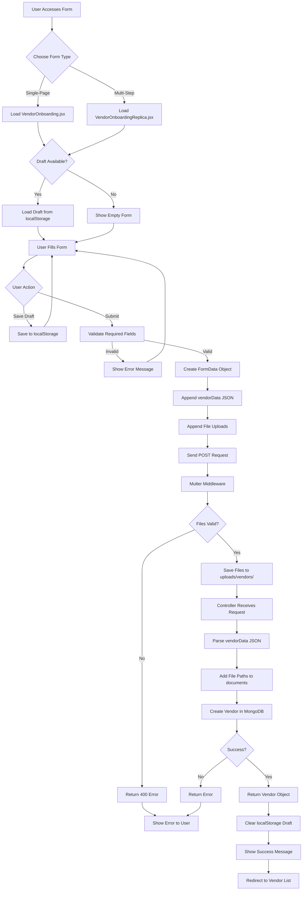

# Vendor Onboarding Workflow Documentation

## 📋 Overview

This document describes the complete workflow for vendor onboarding in the SMG system, from initial form access to final document storage.

---

## 🔄 Complete Workflow Diagram



---

## 📝 Detailed Workflow Steps

### Phase 1: Form Access & Initialization

#### Step 1.1: User Navigates to Form
```
URL OPTIONS:
- /vendor/onboarding          → Single-page form
- /vendor/onboarding-replica  → Multi-step wizard
```

**Component Loaded**: `VendorOnboarding.jsx` or `VendorOnboardingReplica.jsx`

#### Step 1.2: Component Mount
```javascript
// On mount, useEffect runs
useEffect(() => {
    // Check for existing draft
    const draft = localStorage.getItem('vendorDraft');
    
    if (draft) {
        // Parse and restore
        const parsed = JSON.parse(draft);
        setFormData(prev => ({ ...prev, ...parsed }));
        
        // For multi-step: restore current step
        setCurrentStep(parsed.currentStep || 1);
        
        console.log('Draft loaded');
    }
}, []);
```

**State Initialized**:
- `formData`: Object with 50+ fields (all empty or default values)
- `loading`: false
- `currentStep`: 1 (multi-step only)

---

### Phase 2: User Interaction

#### Step 2.1: Filling Form Fields

**User Actions**:
1. Types in text fields
2. Selects radio buttons
3. Checks checkboxes
4. Selects files for upload

**State Updates**:
```javascript
// Text input
const update = (key, value) => {
    setFormData(prev => ({ ...prev, [key]: value }));
};

// Checkbox array
const handleCheckboxArray = (key, value) => {
    setFormData(prev => {
        const current = prev[key] || [];
        if (current.includes(value)) {
            return { ...prev, [key]: current.filter(v => v !== value) };
        }
        return { ...prev, [key]: [...current, value] };
    });
};

// File upload
const handleFileChange = (key, file) => {
    setFormData(prev => ({ ...prev, [key]: file }));
};
```

#### Step 2.2: Save Draft (Optional)

**Trigger**: User clicks "💾 Save as Draft" button

**Process**:
```javascript
const saveDraft = () => {
    // 1. Exclude file objects (can't serialize)
    const { cancelledCheque, panDocument, gstDocument, 
            tanDocument, signatureDocument, ...textData } = formData;
    
    // 2. Create draft object
    const draftObj = {
        ...textData,
        currentStep,  // Multi-step only
        savedAt: new Date().toISOString()
    };
    
    // 3. Save to localStorage
    localStorage.setItem('vendorDraft', JSON.stringify(draftObj));
    
    // 4. Notify user
    alert('✅ Draft saved successfully!');
};
```

**Storage Location**: Browser localStorage
**Key**: `vendorDraft` or `vendorDraftReplica`

#### Step 2.3: Navigation (Multi-Step Only)

**Previous Button**:
```javascript
const handlePrev = () => setCurrentStep(prev => Math.max(prev - 1, 1));
```

**Next Button**:
```javascript
const handleNext = () => setCurrentStep(prev => Math.min(prev + 1, 5));
```

**Step Progress**:
```
Step 1: Supplier & Address       (Document Control, Name, Address)
Step 2: Payment & Contact        (Currency, Payment Terms, Contact Details, GST Contact)
Step 3: Bank & Status            (Bank, Vendor Status, Industrial Status, Staff)
Step 4: Products & Docs          (Dealer/Distributor, Product Range, PAN, GST)
Step 5: Compliance & Final       (GST Class, TAN, SMG Registration, Supply Mode, Signature)
```

---

### Phase 3: Form Submission

#### Step 3.1: Validation

**Trigger**: User clicks "Submit Application" button

**Validation Checks**:
```javascript
if (!formData.supplierName || !formData.emailId || !formData.phoneWithCode) {
    alert('Please fill in all required fields');
    return;  // Stop submission
}
```

**Required Fields**:
- ✅ Supplier Name
- ✅ Email ID
- ✅ Phone (with STD Code)

#### Step 3.2: FormData Preparation

**Create FormData Object**:
```javascript
const formDataToSend = new FormData();

// 1. Prepare vendor data object
const vendorData = {
    // Core fields
    name: formData.supplierName,
    type: formData.vendorStatus.join(', ') || 'N/A',
    contact: formData.contactPerson || 'N/A',
    email: formData.emailId,
    phone: formData.mobileWithCountryCode || formData.phoneWithCode,
    city: formData.city || '',
    
    // Extended fields
    companyPrefix: formData.companyPrefix,
    houseNo: formData.houseNo,
    address: {
        street: formData.street,
        state: formData.state,
        zip: formData.pinCode,
        country: 'India'
    },
    nearestRailwayStation: formData.nearestRailwayStation,
    nearestAirport: formData.nearestAirport,
    currency: formData.currency,
    paymentTerms: formData.paymentTerms,
    
    // ... all other fields mapped
};

// 2. Add to FormData as JSON string
formDataToSend.append('vendorData', JSON.stringify(vendorData));

// 3. Add file uploads
if (formData.cancelledCheque) {
    formDataToSend.append('cancelledCheque', formData.cancelledCheque);
}
if (formData.panDocument) {
    formDataToSend.append('panDocument', formData.panDocument);
}
if (formData.gstDocument) {
    formDataToSend.append('gstDocument', formData.gstDocument);
}
if (formData.tanDocument) {
    formDataToSend.append('tanDocument', formData.tanDocument);
}
if (formData.signatureDocument) {
    formDataToSend.append('signatureDocument', formData.signatureDocument);
}
```

#### Step 3.3: API Request

**HTTP Request**:
```javascript
setLoading(true);  // Show loading state

const response = await apiClient.post('/vendors', formDataToSend, {
    headers: {
        'Content-Type': 'multipart/form-data'
    }
});
```

**Request Details**:
- **Method**: POST
- **URL**: `/api/v1/vendors`
- **Headers**: 
  - `Authorization: Bearer [token]`
  - `Content-Type: multipart/form-data`
- **Body**: FormData object with vendorData + files

---

### Phase 4: Backend Processing

#### Step 4.1: Route Handler

**Route Configuration**:
```javascript
// backend/routes/vendor.js
router.route('/')
    .post(protect, uploadVendorDocs, createVendor);
```

**Middleware Chain**:
1. `protect` - Authentication check
2. `uploadVendorDocs` - File upload handling (multer)
3. `createVendor` - Business logic

#### Step 4.2: Multer Middleware

**File Processing**:
```javascript
// backend/middleware/upload.js
const upload = multer({
    storage: multer.diskStorage({
        destination: 'uploads/vendors/',
        filename: (req, file, cb) => {
            // Generate unique filename
            const uniqueName = `${sanitizedName}_${file.fieldname}_${timestamp}${ext}`;
            cb(null, uniqueName);
        }
    }),
    fileFilter: (req, file, cb) => {
        // Validate file type
        if (/pdf|jpeg|jpg|png/.test(file.mimetype)) {
            cb(null, true);
        } else {
            cb(new Error('Invalid file type'));
        }
    },
    limits: {
        fileSize: 5 * 1024 * 1024  // 5MB max
    }
});
```

**Actions**:
1. ✅ Validate file type (PDF, JPG, PNG)
2. ✅ Validate file size (max 5MB)
3. ✅ Generate unique filename
4. ✅ Save file to `uploads/vendors/`
5. ✅ Attach file info to `req.files`

**Result**:
```javascript
req.files = {
    cancelledCheque: [{ path: 'uploads/vendors/supplier_cancelledCheque_123.pdf', ... }],
    panDocument: [{ path: 'uploads/vendors/supplier_panDocument_124.pdf', ... }],
    // ... etc
}
```

#### Step 4.3: Controller Logic

**Parse Request**:
```javascript
// backend/controllers/vendorController.js
let vendorData = {};

if (req.body.vendorData) {
    // Parse JSON from FormData
    vendorData = JSON.parse(req.body.vendorData);
}

// Add file paths
if (req.files) {
    vendorData.documents = {
        cancelledCheque: req.files.cancelledCheque?.[0]?.path,
        panDocument: req.files.panDocument?.[0]?.path,
        gstDocument: req.files.gstDocument?.[0]?.path,
        tanDocument: req.files.tanDocument?.[0]?.path,
        signatureDocument: req.files.signatureDocument?.[0]?.path
    };
}
```

**Database Save**:
```javascript
const vendor = await Vendor.create(vendorData);
```

**Mongoose Actions**:
1. Generate `vendorId` (V-XXXX) via pre-save hook
2. Validate required fields
3. Save to MongoDB
4. Return created document

**Response**:
```javascript
res.status(201).json(vendor);
```

---

### Phase 5: Response Handling

#### Step 5.1: Success Response

**Frontend Receives**:
```javascript
if (response.data) {
    // 1. Clear localStorage draft
    localStorage.removeItem('vendorDraft');
    
    // 2. Show success message
    alert('Vendor registered successfully with all documents!');
    
    // 3. Redirect to vendor list
    navigate('/vendor/list');
}
```

**User Experience**:
1. ✅ Alert notification shown
2. ✅ Draft cleared automatically
3. ✅ Redirected to vendor list page
4. ✅ New vendor visible in list

#### Step 5.2: Error Response

**Error Handling**:
```javascript
catch (error) {
    console.error('Error submitting vendor:', error);
    
    const errorMessage = error.response?.data?.message 
        || error.message 
        || 'Failed to register vendor';
    
    alert(`Failed to register vendor: ${errorMessage}`);
}
finally {
    setLoading(false);  // Hide loading state
}
```

**User Experience**:
1. ❌ Error message displayed
2. ❌ Form remains filled (data not lost)
3. ❌ User can correct and retry
4. ❌ Loading state cleared

---

## 🔍 Workflow Variations

### Variation 1: Multi-Step Form

**Differences**:
```javascript
// Additional state
const [currentStep, setCurrentStep] = useState(1);

// Draft includes current step
localStorage.vendorDraftReplica = {
    ...formData,
    currentStep: 3,
    savedAt: "..."
};

// Step navigation
<button onClick={handleNext}>Next Step</button>
<button onClick={handlePrev}>Previous Step</button>
<button onClick={currentStep === 5 ? handleSubmit : handleNext}>
    {currentStep === 5 ? 'Submit' : 'Next'}
</button>
```

**User Flow**:
```
Step 1 → Fill fields → Click Next
Step 2 → Fill fields → Click Next
Step 3 → Fill fields → Upload files → Click Next
Step 4 → Upload files → Click Next
Step 5 → Upload files → Click Submit
```

### Variation 2: Draft Recovery

**Scenario**: User closes browser mid-filling

**On Return**:
```javascript
1. Component mounts
2. useEffect checks localStorage
3. Draft found → Parse JSON
4. Restore all fields
5. Multi-step: Jump to saved step
6. User sees notification: "Draft loaded from [date]"
7. User continues from where they left
```

### Variation 3: File-Only Upload

**Scenario**: User uploads files without text data

**Validation Result**:
```javascript
if (!formData.supplierName || !formData.emailId || !formData.phoneWithCode) {
    alert('Please fill required fields');
    return;  // Stops submission
}
```

**Outcome**: Files are NOT uploaded until required fields filled

---

## 📊 Workflow Timeline

### Best Case (All Data Ready)
```
1. Load form:          1s
2. Fill all fields:    3-5 min
3. Upload 5 files:     10-15s
4. Submit & process:   3-5s
5. Redirect:           1s
──────────────────────────
Total:                 4-6 min
```

### With Draft Saving
```
Session 1:
1. Load form:          1s
2. Fill 50% fields:    2 min
3. Save draft:         <1s
4. Close browser:      -
──────────────────────────
Session 1 Total:       ~2 min

Session 2:
1. Load form:          1s
2. Restore draft:      <1s
3. Fill remaining:     2-3 min
4. Upload files:       10-15s
5. Submit:             3-5s
6. Redirect:           1s
──────────────────────────
Session 2 Total:       3-4 min
──────────────────────────
Grand Total:           5-6 min
```

---

## 🎯 Success Criteria

### Form Submission Success When:
- ✅ All required fields filled
- ✅ Files uploaded (optional but recommended)
- ✅ Valid email format
- ✅ Authentication token present
- ✅ Network connection stable
- ✅ Backend server running
- ✅ MongoDB accessible
- ✅ File storage writable

### Form Submission Fails When:
- ❌ Required fields missing
- ❌ File too large (>5MB)
- ❌ Invalid file type
- ❌ Network error
- ❌ Authentication expired
- ❌ Server error (500)
- ❌ Database error
- ❌ Disk space full

---

## 🔧 Troubleshooting Workflow Issues

### Issue: Draft Not Saving
**Diagnosis**:
```javascript
// Check localStorage availability
if (typeof localStorage !== 'undefined') {
    console.log('localStorage available');
} else {
    console.log('localStorage NOT available');
}

// Check storage quota
navigator.storage.estimate().then(estimate => {
    console.log(`Using ${estimate.usage} of ${estimate.quota} bytes`);
});
```

**Solutions**:
1. Check browser privacy settings
2. Check storage quota not exceeded
3. Try different browser
4. Clear existing storage

### Issue: Files Not Uploading
**Diagnosis**:
```javascript
// Check FormData contents
for (let pair of formDataToSend.entries()) {
    console.log(pair[0], pair[1]);
}

// Check network tab
// Look for multipart/form-data content-type
// Verify files in request payload
```

**Solutions**:
1. Check file size < 5MB
2. Check file type (PDF, JPG, PNG)
3. Check multer middleware installed
4. Check uploads folder permissions
5. Check network request completes

### Issue: Validation Errors
**Diagnosis**:
```javascript
console.log('Required fields:');
console.log('Supplier Name:', formData.supplierName);
console.log('Email:', formData.emailId);
console.log('Phone:', formData.phoneWithCode);
```

**Solutions**:
1. Fill all required fields (marked with *)
2. Check email format valid
3. Check phone number entered
4. Clear browser cache if fields not responding

---

## 📝 Workflow Best Practices

### For Users
1. ✅ Save draft frequently
2. ✅ Upload files in correct format
3. ✅ Fill required fields first
4. ✅ Use descriptive supplier names (uppercase)
5. ✅ Verify email before submitting
6. ✅ Keep file sizes under 5MB

### For Developers
1. ✅ Always validate on both frontend and backend
2. ✅ Handle all error cases gracefully
3. ✅ Provide clear error messages
4. ✅ Log important workflow steps
5. ✅ Test with large files
6. ✅ Test draft save/restore
7. ✅ Monitor localStorage usage
8. ✅ Clean up failed uploads

---

**Document Version**: 1.0  
**Last Updated**: December 25, 2024  
**Maintained By**: SMG Development Team
